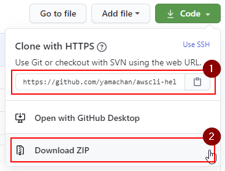

# awscli-help / SHLT for AWS CLI

ver 1.01 - 2020/07/25

This is a simple web application for AWS CLI users to lookup its help contents.

## Overview

The following is a screenshot of SHLT (Simple Help Lookup Tool) for AWS CLI (Amazon Web Services Command Line Interface) ver 1.00.


As you see, you can see list of all services/commands of AWS CLI tool, and filter it with keywords.

I developed this tool for my learning of AWS CLI tool. But maybe, it can be useful for all AWS CLI users when they write a script code with using lots of AWS CLI commands.

## How to use

### Use Demo site

Sometimes, you can use the demo site of this application. My test environment is poor, so please don't expect that you can use it usually.

* [https://rinco.jp/awscli/](https://rinco.jp/awscli/)

This is an OSS tool, and the original content is not mine. I hope someone will replicate this service. :-)

### Simply use it locally

You can get all necessary files from this GitHub repository.



1. Clone this repository with Git tools OR
2. Download zip file, and extract it

Then, open ``index.html`` file with your web browser (I tested this with Chrome, Firefox or Edge on Windows10).

### Update help content

At first, you need to install [AWS CLI tool](https://docs.aws.amazon.com/cli/latest/userguide/cli-chap-install.html) and [Node.js](https://nodejs.org/) runtime on your local PC.

``app.js`` is a tool to create or update the help content, ``awscli.js`` file. Please run the following code on the project folder. It takes a few hours.

```
node app.js awscli.js
```

Before this, you can delete or rename the ``awscli.js`` file. In this case, this tool re-create the help file from scratch.

These local help texts are also useful with text search tools, like fgrep. :-)

### Ajax mode (from ver 1.01)

To reduce the network traffic, I added one more simple tool to convert one big JSON file into small text files. This GitHub repo doesn't include these small files. If you want to use it, please run locally:

```
node app.js awscli.js html
```

You can find a set of web site files in ``html`` folder. Please upload it (or run the local server, like webserv in it), then access the site.

I updated my test page with this function.

* [https://rinco.jp/awscli/](https://rinco.jp/awscli/)

## Future plan?

I had developed these tools in a day, so I have lots of items which I want to use.

* Deta optimization - the help data is duplicated, and need to be optimized (e.g. Available Services/Commands section)
* Data compression - the raw JSON data is too large to download, so we need some logic to compress it
* (OR) dynamic download (locally exec AWS-CLI command) to get detailed help contents - It means the tool will have a list of command names at first
* Translation - I know some translation services (APIs) on cloud, so I want to translate (and cache) English help text to our local languages automatically.

# Update log

| version | update | memo |
| --- | --- | --- | 
| ver 1.00 | 2020/07/18 | First version. Simply dump tool's help into one large json file. |
| ver 1.01 | 2020/07/25 | Add a app-html tool and SPA application with Ajax mode to reduce the network traffic. |
